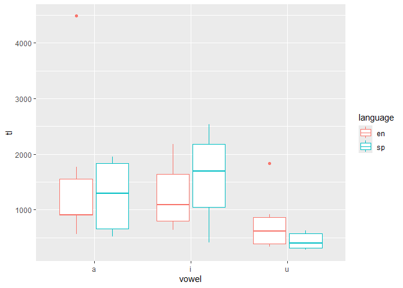
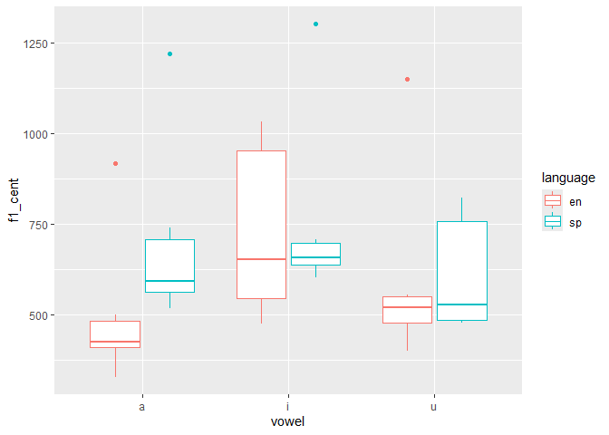
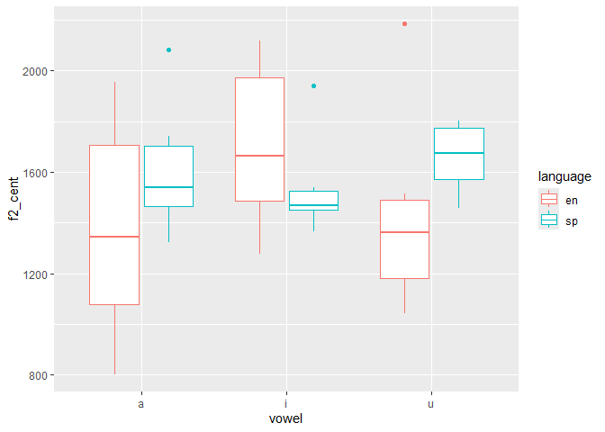

# Programming assignment 3

2025-11-06

\##Load libraries and data

``` r
library("tidyverse")
```

    ── Attaching core tidyverse packages ──────────────────────── tidyverse 2.0.0 ──
    ✔ dplyr     1.1.4     ✔ readr     2.1.5
    ✔ forcats   1.0.1     ✔ stringr   1.5.1
    ✔ ggplot2   4.0.0     ✔ tibble    3.3.0
    ✔ lubridate 1.9.4     ✔ tidyr     1.3.1
    ✔ purrr     1.1.0     
    ── Conflicts ────────────────────────────────────────── tidyverse_conflicts() ──
    ✖ dplyr::filter() masks stats::filter()
    ✖ dplyr::lag()    masks stats::lag()
    ℹ Use the conflicted package (<http://conflicted.r-lib.org/>) to force all conflicts to become errors

``` r
library("untidydata")

vowels <- read_csv("data/vowel_data.csv")
```

    Rows: 36 Columns: 17
    ── Column specification ────────────────────────────────────────────────────────
    Delimiter: ","
    chr  (4): id, item, vowel, language
    dbl (13): f1_cent, f2_cent, tl, f1_20, f1_35, f1_50, f1_65, f1_80, f2_20, f2...

    ℹ Use `spec()` to retrieve the full column specification for this data.
    ℹ Specify the column types or set `show_col_types = FALSE` to quiet this message.

\##Descriptive statistics

``` r
vowel_summary <- vowels %>%
  group_by(vowel, language) %>%
  summarize(
    f1_avg = mean(f1_cent, na.rm = TRUE),
    f1_sd  = sd(f1_cent, na.rm = TRUE),
    f2_avg = mean(f2_cent, na.rm = TRUE),
    f2_sd  = sd(f2_cent,  na.rm = TRUE),
    tl_avg = mean(tl, na.rm = TRUE),
    tl_sd  = sd(tl,na.rm = TRUE),
    n = n()
  )
```

    `summarise()` has grouped output by 'vowel'. You can override using the
    `.groups` argument.

\##Plots

``` r
vowels |>
  ggplot(aes(x = vowel, y = tl, color = language)) +
  geom_boxplot()
```



``` r
vowels |>
  ggplot(aes(x = vowel, y = f1_cent, color = language)) +
  geom_boxplot()
```



``` r
vowels |>
  ggplot(aes(x = vowel, y = f2_cent, color = language)) +
  geom_boxplot()
```



\##Questions

1 Pregunta: Creo que esto funciona porque los valores de comienzo de la
vocal y el final de la vocal están definidos en el codigo y esto permite
calcular la duración No entiendo cuál es la función de los valores 0.2 y
0.35, etc.

2 Pregunta: El propósito general del script es hacer la extracción de
medidas acústicas de las vocales segmentadas en cada lengua. Está
dividido en secciones: primero abre el archivo de sonido y el TextGrid,
luego recorre cada intervalo (cada vocal), obtiene los límites de inicio
y fin, hace algo con los valores que no entendí bien y finalmente extrae
valores como F1, F2 o intensidad en esos puntos, guardando los
resultados en una tabla o archivo.

3 Pregunta: Esta vez nos centramos en la media de los formantes y cómo
cambian. La tarea anterior solo obtuvimos un valor para midpoint.

Nota: Me ayude de chatgpt para responder a las preguntas y para hacer la
primera parte entonces el chat creó el codigo con cosas que no entendí
muy bien como na.rm = false que algo debe estar borrando o impidiendo.
